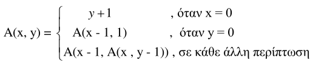

# Course Assignments: Learning Assembly

## Description

This is a series of six assignments implemented for the requirements of the university course "Digital Computers ACE201" in 2014-2015.  
The assignments were carried out by a two-person team, Andreas Polychronakis and Zisis Charokopos.  
The description files of the assignments are not uploaded.

## Technologies Used

- Languages: C, "c-lang", Assembly
- Tools: [PCspim](https://spimsimulator.sourceforge.net/)

## First Assignment

File:

```text
ACE201/
├── assignment_1/
│   └── lab1.c
├── assignment_2/
├── assignment_3/
├── assignment_4/
├── assignment_5/
├── assignment_6/
└── README.md
```

In the first assignment, the goals are, to familiarize with the hexadecimal representation in C, and to understand the memory structure and the assignment of variables, functions, and pointers in it.

## Second Assignment

Files:

```text
ACE201/
├── assignment_1/
├── assignment_2/
│   ├── lab2.c
│   ├── Lab2.txt
│   └── Lab2.asm
├── assignment_3/
├── assignment_4/
├── assignment_5/
├── assignment_6/
└── README.md
```

For the second assignment, the goals are, to familiarize with a made-up programming language, the c-lang, and with the [PCspim](https://spimsimulator.sourceforge.net/), an assembly MIPS simulator. C-lang is used as a step before assembly, for a better understanding of how the assembly language works.

The C code was converted to c-lang, and various tests were conducted using PCspim for better understanding.

## Third Assignment

Files:

```text
ACE201/
├── assignment_1/
├── assignment_2/
├── assignment_3/
│   ├── lab3_clang.txt
│   └── lab3.asm
├── assignment_4/
├── assignment_5/
├── assignment_6/
└── README.md
```

For the third assignment, the goals are, to learn how to load large constants into registers, and how to do comparissons.  
It was requested to convert the code, from C to c-lang, and then in assembly. Also, it should explained how the 20bit constant assignment is done and the comparisson j < 7.

## Fourth Assignment

Files:

```text
ACE201/
├── assignment_1/
├── assignment_2/
├── assignment_3/
├── assignment_4/
│   ├── lab_4.txt
│   ├── lab_4az.asm
│   ├── Lab_4_C.c
│   └── Lab_4_clang.c
├── assignment_5/
├── assignment_6/
└── README.md
```

For the fourth assignment, the goals are, to familirize with function calling, and how to manage arrays in assembly.  
It was requested to develop a program that will read strings from the keyboard, print a menu in the terminal, read the choice of the user, then process the string, and finally print the modified string.  
The editing options are the following,

- convert to UPPERCASE
- convert to Title Case
- exit

## Fifth Assignment

Files:

```text
ACE201/
├── assignment_1/
├── assignment_2/
├── assignment_3/
├── assignment_4/
├── assignment_5/
│   ├── lab_5_ass.asm
│   ├── lab_5_c.c
│   └── lab_5_clang.c
├── assignment_6/
└── README.md
```

For the fifth assignment, the goals are, to familiarize with the stack use, recursive function calling, SPIM system calls, and MIPS register use conventions.  
It was requested to develop a program that will ask and read two numbers and check if they are not negative. After that, a menu is displayed with the following options,

- Run
- Exit

If the user chooses `Run`, the Ackermann function will be called.  
If the user chooses `Exit`, the program will terminate.

The Ackermann formula goes as follows,


It is worth mentioning that the `sw` and `lw` commands should be called for the proper function call operation. Additionally, it is important to know which of the variables should be saved (caller-callee save).

## Sixth Assignment

Files:

```text
ACE201/
├── assignment_1/
├── assignment_2/
├── assignment_3/
├── assignment_4/
├── assignment_5/
├── assignment_6/
│   ├── exceptions - lab6.s
│   ├── lab_6_1.asm
│   └── lab_6_2.asm
└── README.md
```

For the sixth assignment, the goals are, to familiarize with the I/O devices with the use of Memory Mapped I/O, polling, and interrupts.  
In the first part, the Memory Mapped I/O and the polling techniques are tested.  
In the second part, the interrupts/exceptions are tested.

## Contributors

- [Andreas Polychronakis](https://github.com/your-username)
- [Zisis Charokopos](https://github.com/zisxar)
